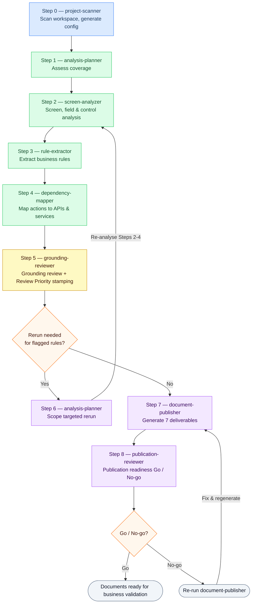

# RE Agent Pack

A reusable AI-assisted reverse-engineering pipeline for legacy codebases.
Drop it into any project, run the agents through GitHub Copilot in VS Code,
and get governed artifacts ready for modernisation planning.

---

## What it produces

- Screen inventory and field dictionary
- Business rules extracted with Review Priority flags so stakeholders can focus validation effort on inferred or ambiguous rules
- Action → API dependency mapping
- Candidate service decomposition
- Traceability matrix
- Publication-ready Reverse-Engineered Business Requirements, Reverse-Engineered Technical Specification, Architecture Flow, Forward Engineering Modernization Blueprint, and Forward Engineering API Taxonomy (with a Rendering Handoff and Publication Contract for Word generation)

---

## How to run

Full run order with copy-paste prompts: [`pipeline/GUIDE.md`](pipeline/GUIDE.md)



---

## Quick start

**Step 1 — install into your project**

```bash
curl -sSL https://raw.githubusercontent.com/sasCapDev/re-agent-pack/main/install.sh | bash
```

**Step 2 — generate the config**

Open GitHub Copilot chat in VS Code. Select the `project-scanner` agent. Paste:

```
Scan this project workspace and generate RE_AGENTS_CONFIG.md.
```

Review any `[REVIEW: ...]` fields the agent flags in `RE_AGENTS_CONFIG.md`, then run:

```bash
bash pipeline/scripts/update-checksums.sh
```

**Step 3 — follow the run order**

Open [`pipeline/GUIDE.md`](pipeline/GUIDE.md) and follow the steps in sequence.
For each step: open Copilot chat, select the agent shown, paste the prompt.

---

## What's in this repo

| Folder | Contents |
|---|---|
| `.github/agents/` | The 7 agent definitions — loaded automatically by VS Code Copilot |
| `pipeline/` | Run order, scripts, and baseline snapshots |
| `pipeline/GUIDE.md` | Full step-by-step guide with copy-paste prompts |
| `pipeline/scripts/` | `update-checksums.sh` and `reset-artifacts.sh` |
| `pipeline/baseline/` | Clean artifact snapshots for resetting the pipeline |
| `artifacts/` | All RE analysis outputs written by the agents |
| `docs/` | Operating rules, reviewer guide, and final output documents |
| `docs/final_output/` | Seven final deliverables: Reverse-Engineered Business Requirements, Reverse-Engineered Technical Specification, Architecture Flow, Forward Engineering Modernization Blueprint, Forward Engineering API Taxonomy, Rendering Handoff, Publication Contract |
| `sample-project/` | Sample legacy VC++ / MFC codebase used to illustrate the pipeline |
| `presentation/` | Visual deliverable explaining the architecture and rule extraction process |

---

## Agents

| Agent | Step | Role |
|---|---|---|
| `project-scanner` | 0 | Scans workspace; auto-generates `RE_AGENTS_CONFIG.md` |
| `analysis-planner` | 1, 6 | Coverage assessment, change detection, and rerun scoping |
| `screen-analyzer` | 2 | UI screen, field, and control analysis |
| `rule-extractor` | 3 | Business rule extraction into the rule register |
| `dependency-mapper` | 4 | Action → service → API → candidate decomposition |
| `grounding-reviewer` | 5 | Grounding review + Review Priority stamping (Priority / Standard) |
| `document-publisher` | 7 | Generates 7 deliverables: Reverse-Engineered Business Requirements, Reverse-Engineered Technical Specification, Architecture Flow, Forward Engineering Modernization Blueprint, Forward Engineering API Taxonomy, Rendering Handoff, Publication Contract |
| `publication-reviewer` | 8 | Publication readiness Go / No-go on the 7 final-output documents |

---

## Who reviews the rules?

There is no in-repo approval step. The final Word documents generated by Step 7 are the review artifact — send them to business stakeholders for validation. To help reviewers focus, Step 5 stamps each rule with a **Review Priority**: **Priority** rules (inferred, sample-derived, or ambiguous) warrant close reading; **Standard** rules (code-grounded, no gaps) can be skimmed. See [`docs/REVIEWER_GUIDE.md`](docs/REVIEWER_GUIDE.md) for the reader-facing explanation.

---

## Large codebases (30+ dialog files)

The `project-scanner` automatically enters batch mode — it groups dialogs into subdomains and generates one config file per group plus a master index. Run the full pipeline once per subdomain; each subdomain's artifacts are isolated under `artifacts/{SubdomainName}/`. See the **Multi-subdomain workflow** section in `pipeline/GUIDE.md`.
