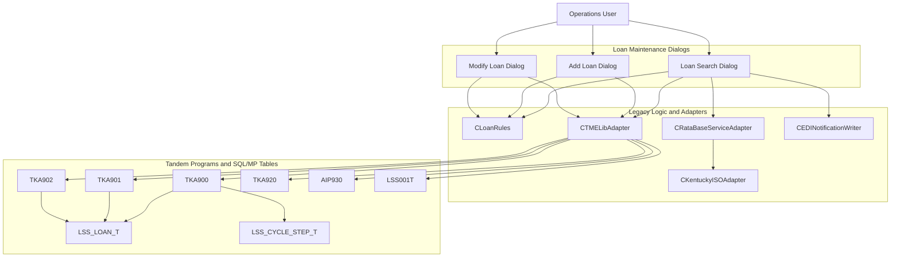
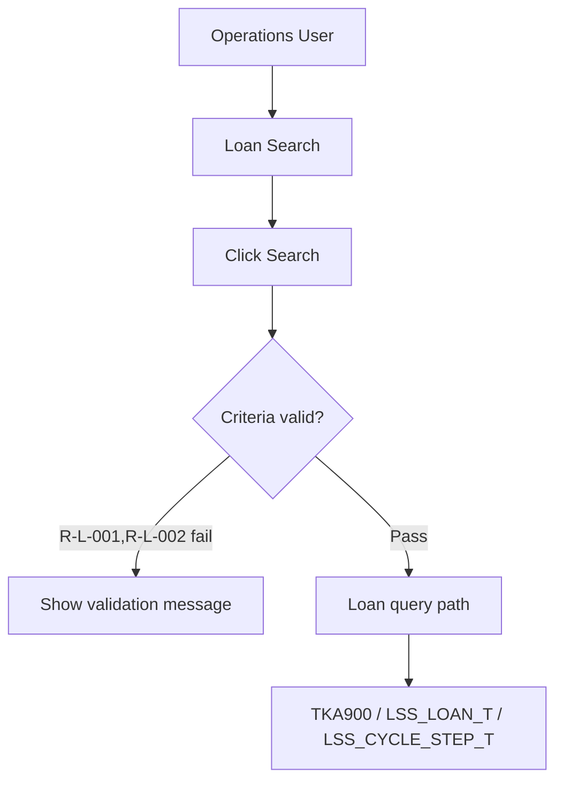
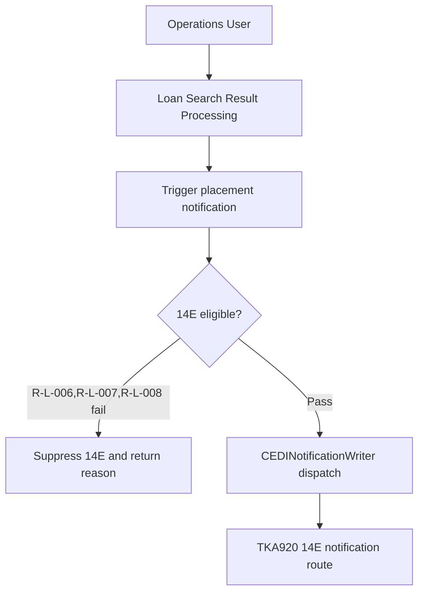
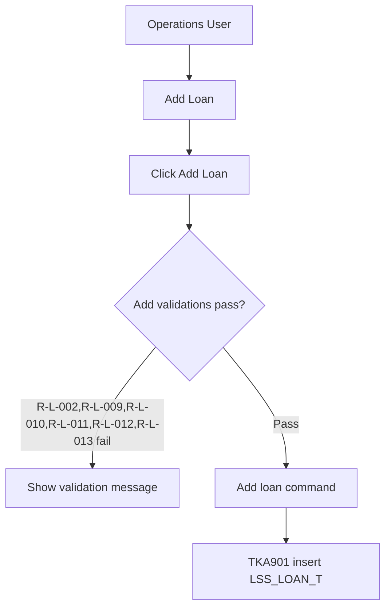
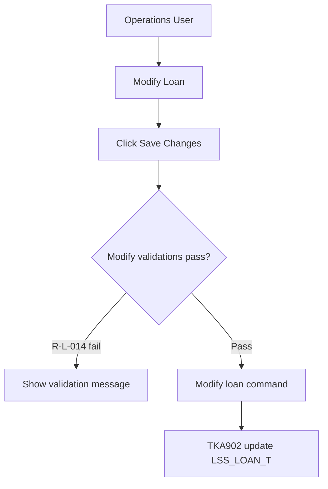
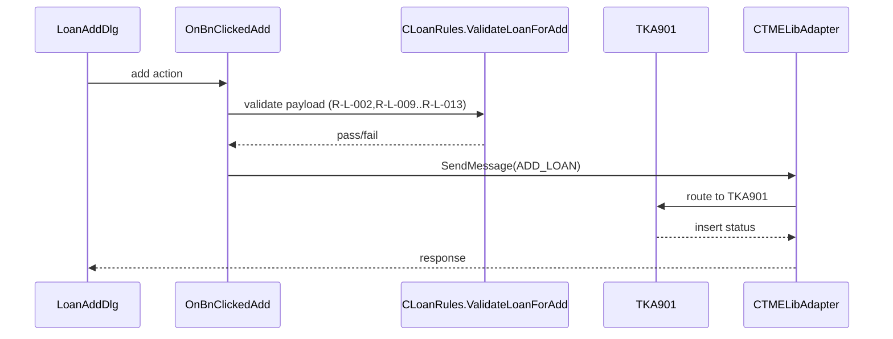
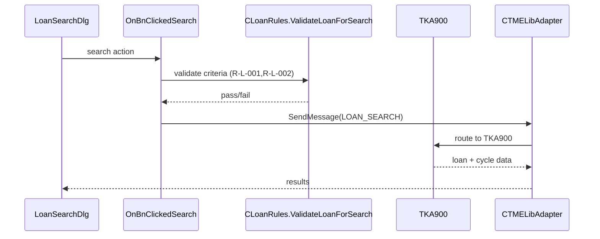
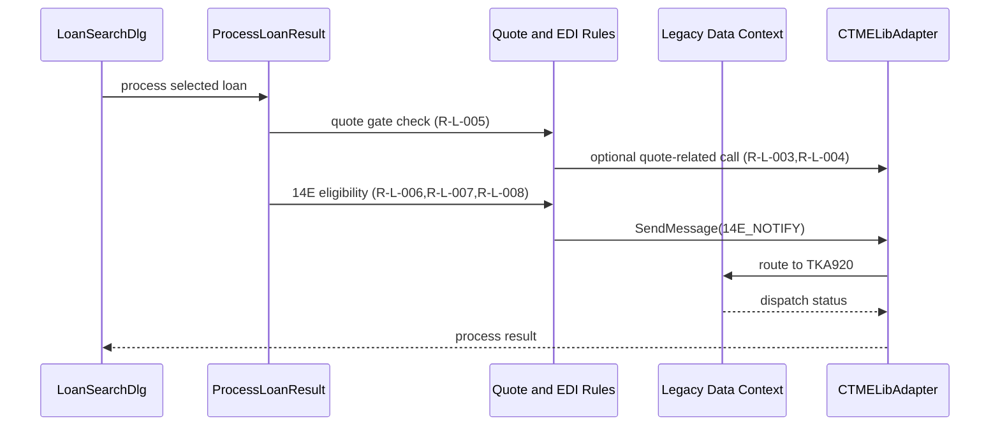

# Current State Architecture Flow

## 1. Current State — System Context



## 2. Business Process Flows

### 2.1 Search Loans (as-is)


### 2.2 Process Search Result with Quote (as-is)
```mermaid
flowchart TD
  Actor[Operations User] --> Screen[Loan Search Results]
  Screen --> Action[Double-click or process selected result]
  Action --> Validate{Quote required and eligible?}
  Validate -->|R-L-005 false| NoQuote[Skip quote path]
  Validate -->|R-L-003,R-L-004 pass| QuoteService[CRataBaseServiceAdapter]
  QuoteService --> External[RataBase and AIP930 (KY branch)]
```

### 2.3 Dispatch 14E Notification (as-is)


### 2.4 Add Loan (as-is)


### 2.5 Modify Loan (as-is)


## 3. Technical Dependency Flows

### 3.1 Save/Add flow


### 3.2 Search flow


### 3.3 Process/notification flow


## 5. Integration Map

| Integration Point | Protocol | Direction | Legacy System | Evidence |
|---|---|---|---|---|
| LOAN_SEARCH mnemonic route | TME over TLS TCP (fgatetcp) | Outbound request/response | TKA900 + SQL/MP tables | LoanSearchDlg::ExecuteLoanSearch; TMELibAdapter::SendMessage |
| ADD_LOAN mnemonic route | TME over TLS TCP (fgatetcp) | Outbound request/response | TKA901 + LSS_LOAN_T | LoanAddDlg::OnBnClickedAdd; TMELibAdapter::SendMessage |
| MODIFY_LOAN mnemonic route | TME over TLS TCP (fgatetcp) | Outbound request/response | TKA902 + LSS_LOAN_T | LoanModifyDlg::OnBnClickedModify; TMELibAdapter::SendMessage |
| KY_ISO_QUERY route | TME over TLS TCP (fgatetcp) | Outbound request/response | AIP930 | RataBaseServiceAdapter::GetQuote; TMELibAdapter routing map |
| 14E_NOTIFY route | TME over TLS TCP (fgatetcp) | Outbound request/response | TKA920 | EDINotificationWriter::Write14ERecord; TMELibAdapter::SendMessage |
| RataBase rating call | External service call | Outbound request/response | RataBase rating engine | RataBaseServiceAdapter::GetQuote |
