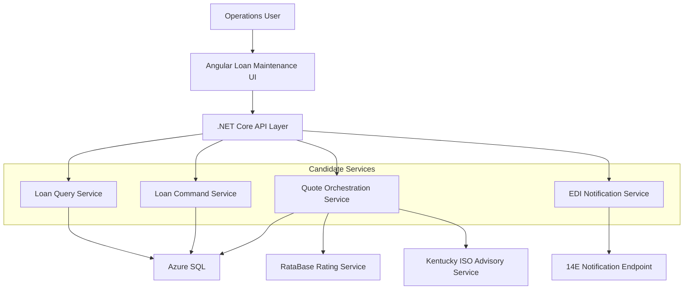
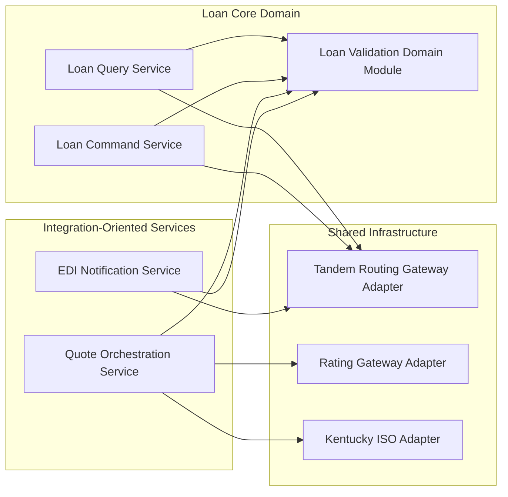
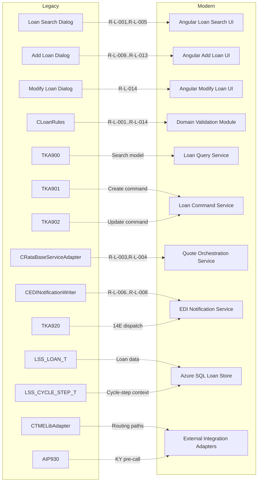

# Modern Stack Architecture Flow

## 1.2 Target State — System Context

## 4. Service Boundary Map

## 5. Integration Map

| Integration Point | Protocol | Direction | Legacy System | Modern Target | Evidence |
|---|---|---|---|---|---|
| LOAN_SEARCH route | TME over TLS TCP (fgatetcp) | Outbound | TKA900 | .NET Core Loan Query Service -> Azure SQL read model | LoanSearchDlg path + service_decomposition mapping |
| ADD_LOAN route | TME over TLS TCP (fgatetcp) | Outbound | TKA901 | .NET Core Loan Command Service create endpoint | LoanAddDlg path + service_decomposition mapping |
| MODIFY_LOAN route | TME over TLS TCP (fgatetcp) | Outbound | TKA902 | .NET Core Loan Command Service update endpoint | LoanModifyDlg path + service_decomposition mapping |
| KY_ISO_QUERY route | TME over TLS TCP (fgatetcp) | Outbound | AIP930 | Quote Orchestration Service integration adapter | RataBaseServiceAdapter KY branch |
| 14E_NOTIFY route | TME over TLS TCP (fgatetcp) | Outbound | TKA920 | EDI Notification Service integration adapter | EDINotificationWriter dispatch path |
| External rating call | External service | Outbound | RataBase rating engine | Quote Orchestration Service external client | RataBaseServiceAdapter::GetQuote |

## 6. Architecture Decision Prompts

### 6.1 Coupling analysis prompts
- The analysis suggests query and command paths are naturally separable because legacy programs split read (TKA900) from write (TKA901/TKA902).
- The analysis suggests quote and EDI orchestration should remain distinct bounded services due to different external dependencies and failure semantics.
- The analysis suggests a shared validation module should be internally reused to avoid divergence between query, command, and orchestration entry points.

### 6.2 Pattern fitness
| Pattern | When it fits | Evidence from this analysis |
|---|---|---|
| modular monolith | When deployment simplicity is preferred but bounded modules are maintained | Services are cohesive but interrelated around one loan-maintenance domain |
| microservices | When independent scaling/deployment of quote/EDI and loan CRUD is required | Distinct external dependencies and rule clusters for quote and EDI paths |
| strangler fig | When replacing legacy routes incrementally by action | Explicit action routing exists per mnemonic and can be replaced endpoint by endpoint |
| CQRS | When query and command behavior differ materially | TKA900 read path and TKA901/TKA902 write paths are already separated |
| event-driven | When notification and quote side-effects should be decoupled | 14E dispatch and quote result processing are event-like side-effect operations |

### 6.3 Framing
The analysis suggests service boundaries and migration order candidates, but does not prescribe a single mandatory architecture pattern.

## 7. Legacy → Modern Mapping

