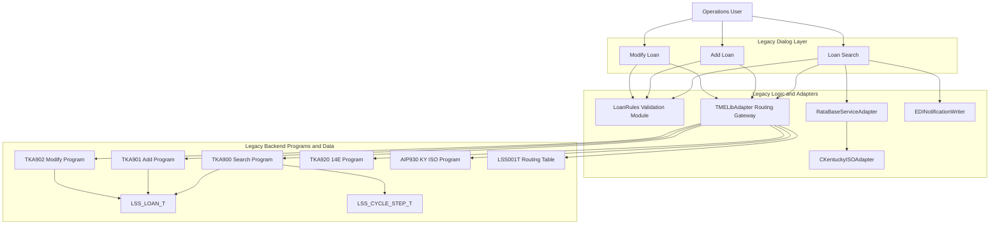

# Reverse-Engineered Business Requirements

## 1. Introduction

### 1.1 Purpose
This document presents business-facing requirements extracted through governed static analysis of the legacy Loan Maintenance source artifacts for the TrackAll platform.

### 1.2 Scope
This run covers Loan Maintenance only: Loan Search, Add Loan, and Modify Loan flows, including quote orchestration and 14E notification dispatch paths. Client Management flows are out of scope.

### 1.3 How to read this document
- Section 3 provides feature-level functional requirements grouped by subdomain slices identified in this run.
- Section 4 presents the business rules register in stakeholder language with Review Priority flags.
- Section 8 gives end-to-end traceability from rule to legacy source, candidate API/service, and proposed test identifier.

### 1.4 Definitions and grounding labels
- source-grounded / code-grounded: directly evidenced in source artifacts.
- sample-only: evidenced only in sample implementation details.
- inferred: reasoned interpretation from artifact-adjacent evidence.
- placeholder: synthetic value used for demonstration; not confirmed production fact.
- unresolved: conflicting or incomplete evidence.

## 2. Business Context

### 2.1 Where this subdomain fits in the system
TrackAllLoanMaintenanceLegacy supports Lender-Placed Insurance loan servicing operations. This analyzed slice sits within Assurant's broader insurance administration system and governs key loan maintenance events: search, create, update, quote decisioning, and 14E notification dispatch.

### 2.2 Subdomain Registry
| Subdomain | Identified Features | Source Dialogs | Key Integration Points |
|---|---|---|---|
| Loan Query | Search execution; result retrieval with cycle-step enrichment | Loan Search | LOAN_SEARCH -> TKA900; LSS_LOAN_T; LSS_CYCLE_STEP_T |
| Loan Command | Add loan; modify loan with transition controls | Add Loan; Modify Loan | ADD_LOAN -> TKA901; MODIFY_LOAN -> TKA902 |
| Rating Orchestration | Quote requirement evaluation; KY ISO pre-call; quote retrieval | Loan Search (result processing) | RataBase adapter; KY_ISO_QUERY -> AIP930 |
| EDI Notification | 14E eligibility gate; format selection; dispatch | Loan Search (result processing) | 14E_NOTIFY -> TKA920; FCI-driven format branch |
| Shared Validation and Routing | Reusable validation logic and mnemonic routing | Loan Search; Add Loan; Modify Loan | LoanRules module; LSS001T mnemonic routing via TMELibAdapter |

### 2.3 This slice vs the full subdomain scope
This extraction covers the Loan Maintenance dialogs and associated Tandem/adapter paths found in the current artifact set. It does not include broader TrackAll areas such as Client Maintenance or Investor/Carrier administration.

### 2.4 System Context - Current State (from code analysis)

## 3. Functional Requirements by Subdomain

### Subdomain: Loan Query
#### Feature: Search criteria validation and execution
Feature description: Validates search criteria and executes read-only loan retrieval through the LOAN_SEARCH route.

| ID | Requirement | Business Rule Ref | Grounding | Review Priority |
|---|---|---|---|---|
| FR-001 | The system must require at least one criterion before executing loan search. | R-L-001 | code-grounded | Standard |
| FR-002 | When provided, loan number must be exactly 10 numeric digits for search and create entry points. | R-L-002 | code-grounded | Standard |

#### Feature: Result-driven processing gate
Feature description: Uses cycle-step context to determine whether quote orchestration should execute.

| ID | Requirement | Business Rule Ref | Grounding | Review Priority |
|---|---|---|---|---|
| FR-005 | The system must trigger quote processing only when quote-required flag equals Y. | R-L-005 | code-grounded | Standard |

### Subdomain: Rating Orchestration
#### Feature: Quote eligibility and KY-specific branch
Feature description: Enforces state eligibility and mandatory KY ISO pre-call before quote retrieval.

| ID | Requirement | Business Rule Ref | Grounding | Review Priority |
|---|---|---|---|---|
| FR-003 | Quote requests must be blocked when property state is not in the approved carrier state list. | R-L-003 | code-grounded | Standard |
| FR-004 | Kentucky quote requests must complete ISO advisory lookup before quote generation. | R-L-004 | code-grounded | Standard |

### Subdomain: EDI Notification
#### Feature: 14E eligibility controls
Feature description: Applies enrollment and cycle-type checks prior to any 14E dispatch.

| ID | Requirement | Business Rule Ref | Grounding | Review Priority |
|---|---|---|---|---|
| FR-006 | 14E dispatch must run only for EDI-enrolled loans. | R-L-006 | code-grounded | Standard |
| FR-007 | 14E dispatch must be suppressed for Instant Issue cycle loans. | R-L-007 | code-grounded | Standard |

#### Feature: Lender form routing constraints
Feature description: Restricts 14E dispatch to recognized lender form identifiers.

| ID | Requirement | Business Rule Ref | Grounding | Review Priority |
|---|---|---|---|---|
| FR-008 | 14E dispatch must allow only registered lender form IDs. | R-L-008 | sample-only | Priority |

### Subdomain: Loan Command
#### Feature: Add loan onboarding validation
Feature description: Enforces required identity, classification, and value constraints prior to create.

| ID | Requirement | Business Rule Ref | Grounding | Review Priority |
|---|---|---|---|---|
| FR-009 | Loan creation must require loan number and borrower name. | R-L-009 | code-grounded | Standard |
| FR-010 | Loan creation must require property value greater than zero. | R-L-010 | code-grounded | Standard |
| FR-011 | Loan creation must require property address. | R-L-011 | code-grounded | Standard |
| FR-012 | Loan creation must enforce ACTIVE status and positive UPB at initial insert. | R-L-012 | code-grounded | Standard |
| FR-013 | Loan creation must accept only RESIDENTIAL or COMMERCIAL property type. | R-L-013 | code-grounded | Standard |

#### Feature: Modify governance constraints
Feature description: Applies immutable key and controlled update rules before update.

| ID | Requirement | Business Rule Ref | Grounding | Review Priority |
|---|---|---|---|---|
| FR-014 | Loan update must preserve immutable loan number, enforce allowed status transitions, disallow UPB increase, and prevent address clear operations. | R-L-014 | unresolved | Priority |

## 4. Business Rules Register

> **Review Priority** flags which rules the business should read closely. **Priority** rules include inferred, sample-derived, or ambiguous content and warrant careful validation. **Standard** rules trace directly to legacy code and can be skimmed.

### Loan Search
| Rule ID | Rule Statement | Rule Type | Grounding | Review Priority |
|---|---|---|---|---|
| R-L-001 | Users must enter at least one search value before running a loan search. | Validation | code-grounded | Standard |

### Loan Identification
| Rule ID | Rule Statement | Rule Type | Grounding | Review Priority |
|---|---|---|---|---|
| R-L-002 | When loan number is provided, it must be exactly 10 numeric digits. | Validation | code-grounded | Standard |

### Rating Eligibility
| Rule ID | Rule Statement | Rule Type | Grounding | Review Priority |
|---|---|---|---|---|
| R-L-003 | A quote can only be requested for properties in approved states. | Validation | code-grounded | Standard |

### Rating Orchestration
| Rule ID | Rule Statement | Rule Type | Grounding | Review Priority |
|---|---|---|---|---|
| R-L-004 | Kentucky loans require an ISO advisory lookup before quote generation. | Integration/gateway | code-grounded | Standard |

### Search Result Processing
| Rule ID | Rule Statement | Rule Type | Grounding | Review Priority |
|---|---|---|---|---|
| R-L-005 | Quote generation is required only when the cycle configuration indicates quote required. | State/routing | code-grounded | Standard |

### EDI Eligibility
| Rule ID | Rule Statement | Rule Type | Grounding | Review Priority |
|---|---|---|---|---|
| R-L-006 | 14E notifications can only be sent for loans marked as EDI-enrolled. | Validation | code-grounded | Standard |
| R-L-007 | Loans in Instant Issue cycle do not generate 14E output. | State/routing | code-grounded | Standard |

### EDI Routing
| Rule ID | Rule Statement | Rule Type | Grounding | Review Priority |
|---|---|---|---|---|
| R-L-008 | Only pre-registered lender form IDs are allowed for 14E dispatch. | Validation | sample-only | Priority |

### Loan Onboarding
| Rule ID | Rule Statement | Rule Type | Grounding | Review Priority |
|---|---|---|---|---|
| R-L-009 | A loan cannot be created unless loan number and borrower name are provided. | Validation | code-grounded | Standard |
| R-L-010 | New loans must have a property value greater than zero. | Validation | code-grounded | Standard |
| R-L-011 | Property address is mandatory when creating a loan. | Validation | code-grounded | Standard |

### Loan Lifecycle Initialization
| Rule ID | Rule Statement | Rule Type | Grounding | Review Priority |
|---|---|---|---|---|
| R-L-012 | New loans must start in Active status and include a positive unpaid principal balance. | State/routing | code-grounded | Standard |

### Classification
| Rule ID | Rule Statement | Rule Type | Grounding | Review Priority |
|---|---|---|---|---|
| R-L-013 | Property type must be Residential or Commercial when creating a loan. | Validation | code-grounded | Standard |

### Loan Modification Governance
| Rule ID | Rule Statement | Rule Type | Grounding | Review Priority |
|---|---|---|---|---|
| R-L-014 | Existing loans can be modified only through approved status progression, non-increasing balance, and non-blank address while keeping loan number unchanged. | State/routing | unresolved | Priority |

## 5. Field Reference

### 5.1 Key fields and constraints
| Field | Business Meaning | Constraints | Audit Behavior |
|---|---|---|---|
| LOAN_NUM | Primary loan identifier across search/create/update | Required in create; 10-digit numeric format; immutable in modify | Included in audit payload for quote/14E processing |
| BORROWER_NAME | Borrower identity display/search key | Required in create; optional in search | Included in request/response records |
| PROPERTY_ADDRESS | Collateral address and routing context | Required in create; cannot be cleared in modify (server behavior unresolved) | Included in change and dispatch payloads |
| PROPERTY_STATE | State used for quote eligibility | Must be approved for quote path; KY triggers ISO pre-call | Included in quote decision context |
| EDI_FLAG | Enrollment indicator for 14E dispatch | Must equal Y for 14E | Gates dispatch suppression path |
| CYCLE_TYPE | Loan cycle context | INSTANT_ISSUE suppresses 14E | Used in notification eligibility logic |
| QUOTE_REQD | Cycle-step quote trigger flag | Quote runs only when Y | Drives quote side-effect path |
| UPB | Unpaid principal balance | Positive at create; cannot increase in modify | Included in update validation context |

### 5.2 Validation precedence
If multiple validations apply to one action, target UI/API evaluation should stop at first failure to match legacy guardrail intent.

| Order | Validation kind | Example rule | User experience when it fails |
|---|---|---|---|
| 1 | Required / non-empty | R-L-001, R-L-009, R-L-011 | "Required field is missing." |
| 2 | Format / syntax | R-L-002 | "Loan number must be exactly 10 digits." |
| 3 | Reference / lookup | R-L-003, R-L-008 | "Value is not allowed for this operation." |
| 4 | Cross-field / business constraint | R-L-012, R-L-014 | "Business state transition is not permitted." |

Open item: strict server-side precedence ordering for TKA902 modify validations is not fully evidenced and remains subject to A-001 confirmation.

## 6. Open Items and Ambiguities
| Open Item ID | Open Question | Impacted Rule(s) | Current Status |
|---|---|---|---|
| A-001 | Is property-address clear explicitly rejected server-side in TKA902, or only client-side in sample path? | R-L-014 | Open |
| A-002 | What is the production source of registered lender target form IDs used by 14E routing eligibility? | R-L-008 | Open |

Deferred rules: none currently marked Deferred in the rule register.

## 7. Non-Functional Considerations
- Performance: search and process-result paths call Tandem and external services; timeout handling and retry policies should be explicit in the target APIs.
- Security: loan and borrower fields require transport and API-layer protections in the modernization target.
- Accessibility: target UI should provide clear validation messaging parity for required/format/business-rule failures.

## 8. Traceability Summary
| Rule ID | Functional Area | Review Priority | Legacy Source (file::function) | Integration System | Candidate API / Service | FRD section | Blueprint Spec | Test Case ID |
|---|---|---|---|---|---|---|---|---|
| R-L-001 | Loan Search | Standard | sample-project/src/LoanRules.cpp::ValidateLoanForSearch | TKA900 search validation | GET /api/loans/search (Loan Query Service) | 4.1 | UI-001 + SVC-001 | given_no_search_criteria_then_search_blocked_R-L-001 [suggested] |
| R-L-002 | Loan Identification | Standard | sample-project/src/LoanRules.cpp::ValidateLoanForSearch | TKA901 format validation | GET /api/loans/search; POST /api/loans (Loan Query/Command) | 4.2 | UI-001 + UI-002 + SVC-001 + SVC-002 | given_invalid_loan_number_format_then_validation_error_R-L-002 [suggested] |
| R-L-003 | Rating Eligibility | Standard | sample-project/src/LoanRules.cpp::EnforceCarrierCoverage | RataBase rating gateway | POST /api/quotes/loan/{loanNumber} (Quote Orchestration Service) | 4.3 | UI-001 + SVC-003 | given_unapproved_property_state_then_quote_blocked_R-L-003 [suggested] |
| R-L-004 | Rating Orchestration | Standard | sample-project/src/RataBaseServiceAdapter.cpp::GetQuote | KY_ISO_QUERY -> AIP930 | POST /api/quotes/loan/{loanNumber} (Quote Orchestration Service) | 4.4 | UI-001 + SVC-003 | given_kentucky_property_then_iso_precall_required_R-L-004 [suggested] |
| R-L-005 | Search Result Processing | Standard | sample-project/src/LoanRules.cpp::RequiresQuote | TKA900 cycle-step data | POST /api/loans/{loanNumber}/process-result (Loan Orchestration) | 4.5 | UI-001 + SVC-003 | given_quote_reqd_not_y_then_quote_not_requested_R-L-005 [suggested] |
| R-L-006 | EDI Eligibility | Standard | sample-project/src/LoanRules.cpp::EnforceEdiEligibility | TKA920 dispatch route | POST /api/edi/notifications/14e (EDI Notification Service) | 4.6 | UI-001 + SVC-004 + DB-AUDIT | given_non_edi_enrolled_loan_then_14e_suppressed_R-L-006 [suggested] |
| R-L-007 | EDI Eligibility | Standard | sample-project/src/LoanRules.cpp::EnforceEdiEligibility | TKA920 dispatch route | POST /api/edi/notifications/14e (EDI Notification Service) | 4.6 | UI-001 + SVC-004 + DB-AUDIT | given_instant_issue_cycle_then_14e_suppressed_R-L-007 [suggested] |
| R-L-008 | EDI Routing | Priority | sample-project/src/LoanRules.cpp::LoadLenderTargetForms | lender_target source unresolved | POST /api/edi/notifications/14e (EDI Notification Service) | 4.7 | UI-001 + SVC-004 | given_unregistered_form_id_then_14e_blocked_R-L-008 [suggested] |
| R-L-009 | Loan Onboarding | Standard | sample-project/src/LoanRules.cpp::ValidateLoanForAdd | TKA901 create validation | POST /api/loans (Loan Command Service) | 4.8 | UI-002 + SVC-002 + DB-001 | given_missing_identity_fields_then_create_rejected_R-L-009 [suggested] |
| R-L-010 | Loan Onboarding | Standard | sample-project/src/LoanRules.cpp::ValidateLoanForAdd | TKA901 property value validation | POST /api/loans (Loan Command Service) | 4.8 | UI-002 + SVC-002 + DB-001 | given_non_positive_property_value_then_create_rejected_R-L-010 [suggested] |
| R-L-011 | Loan Onboarding | Standard | sample-project/src/LoanRules.cpp::ValidateLoanForAdd | TKA901 address validation | POST /api/loans (Loan Command Service) | 4.8 | UI-002 + SVC-002 + DB-001 | given_blank_property_address_then_create_rejected_R-L-011 [suggested] |
| R-L-012 | Loan Lifecycle Initialization | Standard | sample-project/src/LoanRules.cpp::ValidateLoanForAdd | TKA901 status and UPB checks | POST /api/loans (Loan Command Service) | 4.9 | UI-002 + SVC-002 + DB-001 | given_non_active_or_non_positive_upb_then_create_rejected_R-L-012 [suggested] |
| R-L-013 | Classification | Standard | sample-project/src/LoanRules.cpp::IsValidPropertyType | TKA901 classification validation | POST /api/loans (Loan Command Service) | 4.10 | UI-002 + SVC-002 + DB-001 | given_invalid_property_type_then_create_rejected_R-L-013 [suggested] |
| R-L-014 | Loan Modification Governance | Priority | sample-project/src/LoanRules.cpp::ValidateLoanForModify | TKA902 update flow | PUT /api/loans/{loanNumber} (Loan Command Service) | 4.11 | UI-003 + SVC-002 + DB-001 | given_invalid_modify_transition_then_update_rejected_R-L-014 [suggested] |

## 9. Appendix
- Grounding labels used: code-grounded, sample-only, unresolved, inferred, placeholder.
- Primary source artifacts: generated_screen_inventory.md, field_dictionary.md, screen_action_api_estimation.md, service_decomposition.md, traceability_matrix.md, rule_register.governance.md, ambiguity_log.governance.md.
- Glossary: see docs/glossary.md for plain-English identifier definitions.
