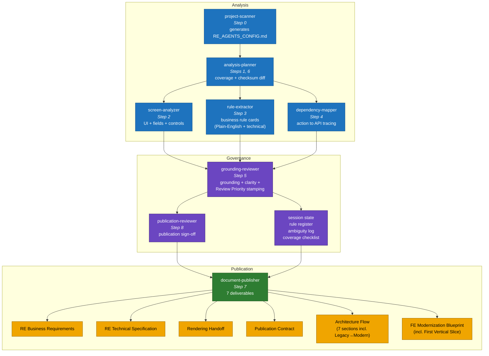

# RE Agent Pack — Phase 1 Solution Architecture

This document is the source for the Phase 1 architecture diagram the leadership deck references. Two Mermaid blocks (main pipeline flow + detailed agent tiles) plus a numbered "High-Level Execution Flow" sidebar, mirroring the structural grammar of the reference architecture image.

This diagram describes the local VS Code + GitHub Copilot pipeline that converts a legacy codebase into modernization deliverables.

## Rendering

- Preview inside a Mermaid-aware viewer (GitHub, VS Code with Mermaid extension, Obsidian) — diagrams render inline.
- For a standalone PNG export, install the Mermaid CLI (`npm install -g @mermaid-js/mermaid-cli`) and run:
  ```bash
  mmdc -i presentation/phase1_architecture_diagram.md -o presentation/phase1_architecture_diagram.png -b transparent
  ```
- If `mmdc` is unavailable, paste each block into https://mermaid.live and export each as a PNG tile, then compose in the tool of your choice.

---

## 1. Main Pipeline Flow

Left-to-right: legacy sources enter the pipeline, flow through 9 step-by-step agents in VS Code + GitHub Copilot, produce governance artifacts under reviewer oversight, and emerge as eight client deliverables. Rule approval does not happen in the repo — the generated Word documents are the review artifact sent to business stakeholders. Step 9 (scaffold-generator) is post-approval only.

```mermaid
flowchart LR
    subgraph Legacy["Legacy Sources"]
        VCPP["VC++ / MFC"]
        COBOL["Tandem COBOL"]
        SQLMP["SQL/MP DDL"]
    end

    ENTRY["VS Code + GitHub Copilot<br/>(reads RE_AGENTS_CONFIG.md)"]

    subgraph Agents["9-Step Pipeline"]
        direction TB
        SCAN["project-scanner"]
        PLAN["analysis-planner"]
        SCREEN["screen-analyzer"]
        RULES["rule-extractor"]
        DEPS["dependency-mapper"]
        GREV["grounding-reviewer"]
        PUB["document-publisher"]
        PREV["publication-reviewer"]
        SCAF["scaffold-generator (post-approval)"]
    end

    subgraph Gov["Governance Artifacts"]
        APPR["rule register"]
        AMBIG["ambiguity log"]
        COV["coverage checklist"]
        STATE["session state"]
    end

    REVIEWER["Business Reviewer<br/>(reads generated Word docs)"]

    subgraph Outputs["8 Client Deliverables"]
        direction TB
        FRD["RE Business Requirements"]
        TECH["RE Technical Specification"]
        CURFLOW["Current State Architecture Flow"]
        MODFLOW["Modern Stack Architecture Flow"]
        BLUEPRINT["FE Modernization Blueprint"]
        TAXON["FE API Taxonomy"]
        BASE["Rendering Handoff"]
        CONTRACT["Publication Contract"]
    end

    Legacy --> ENTRY
    ENTRY --> Agents
    Agents --> Gov
    Gov --> PUB
    PUB --> Outputs
    Outputs -.->|sent for validation| REVIEWER
    Outputs -->|handover| HANDOFF(["Modernization Team"])

    classDef legacy fill:#0066CC,stroke:#003366,color:#fff
    classDef agent fill:#FF9900,stroke:#B36B00,color:#000
    classDef gov fill:#6B46C1,stroke:#3B2171,color:#fff
    classDef output fill:#2E7D32,stroke:#1B4D1E,color:#fff
    classDef hitl fill:#F0A500,stroke:#8C5F00,color:#000
    classDef handoff fill:#9E9E9E,stroke:#5F5F5F,color:#fff,stroke-dasharray: 5 5

    class VCPP,COBOL,SQLMP legacy
    class SCAN,PLAN,SCREEN,RULES,DEPS,GREV,PUB,PREV,SCAF,ENTRY agent
    class APPR,AMBIG,COV,STATE gov
    class FRD,TECH,BASE,CONTRACT,CURFLOW,MODFLOW,BLUEPRINT,TAXON output
    class REVIEWER hitl
    class HANDOFF handoff
```



---

## 2. Agent Tiles by Phase

Three-column grouping of the seven agents plus their governance and publication outputs. Mirrors the middle panel of the leadership reference image — a detailed tile view underneath the main flow.



---

## 3. High-Level Execution Flow

Six Phase-1 phases, numbered in the same style as the leadership reference's right-hand sidebar. Rendered inline next to the diagrams above for a PPT/leaf-behind slide.

1. **Codebase Acquisition & Assessment** — project-scanner reads the repo, generates `RE_AGENTS_CONFIG.md`, captures SHA-256 source checksums.
2. **Reverse-Engineering Analysis** — screen-analyzer, rule-extractor, dependency-mapper extract UI fields, business rule cards (with Plain-English + technical statements), and action→API dependency traces.
3. **Governance Review** — grounding-reviewer verifies grounding, evidence resolution, Plain-English clarity, coverage gaps, functional-area completeness; ambiguities logged.
4. **Design Documentation** — document-publisher produces Functional Requirements, Technical Documentation, and a complete 7-section Flow Architecture including the Legacy → Modern side-by-side view.
5. **Modernization Blueprint** — code-ready UI / API / DB specs plus the "Build the First Vertical Slice" walkthrough and per-API error-handling contracts.
6. **Handover to Modernization Team** — seven governed deliverables handed over (final Word documents validated directly by business stakeholders after Step 8 Go).

---

## Style palette

| Element | Hex | Rendered as |
|---|---|---|
| Legacy components | `#0066CC` | Blue |
| Agents / pipeline | `#FF9900` | Orange |
| Governance | `#6B46C1` | Purple |
| Deliverables | `#2E7D32` | Green |
| HITL / Business reviewer | `#F0A500` | Amber |
| Handoff to modernization team | `#9E9E9E` | Grey |

Colour palette intentionally mirrors the leadership reference image: blue for inputs, orange for callouts, green for outputs.
